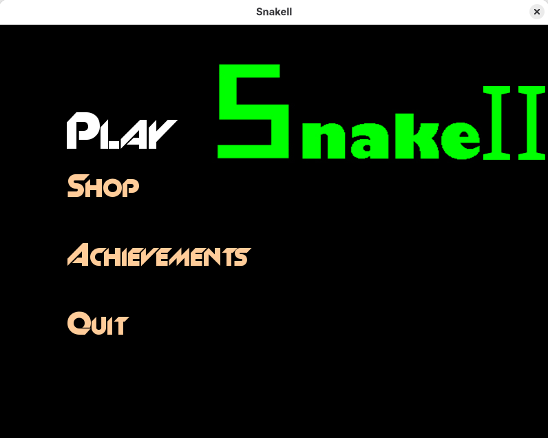
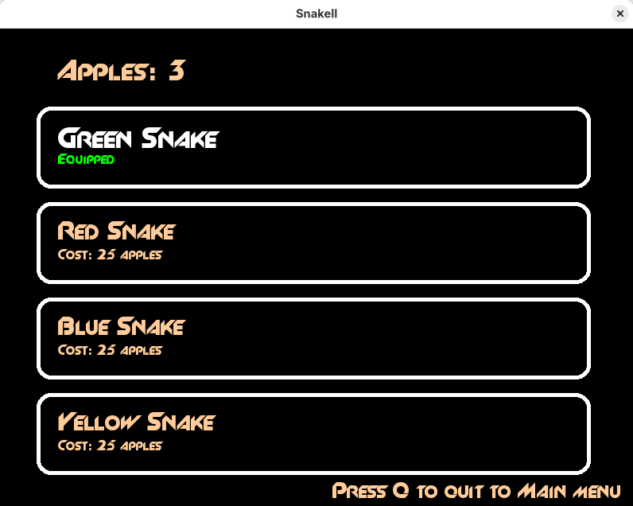
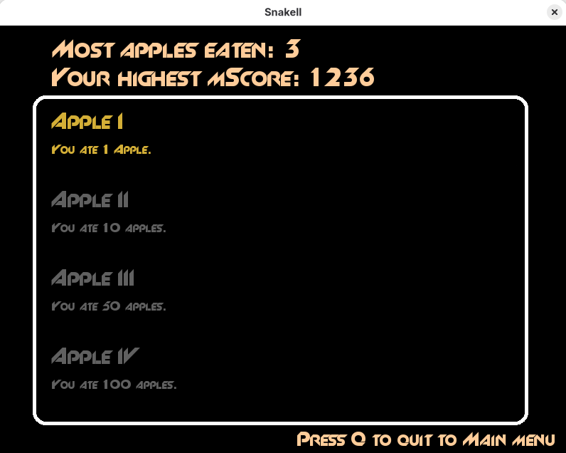
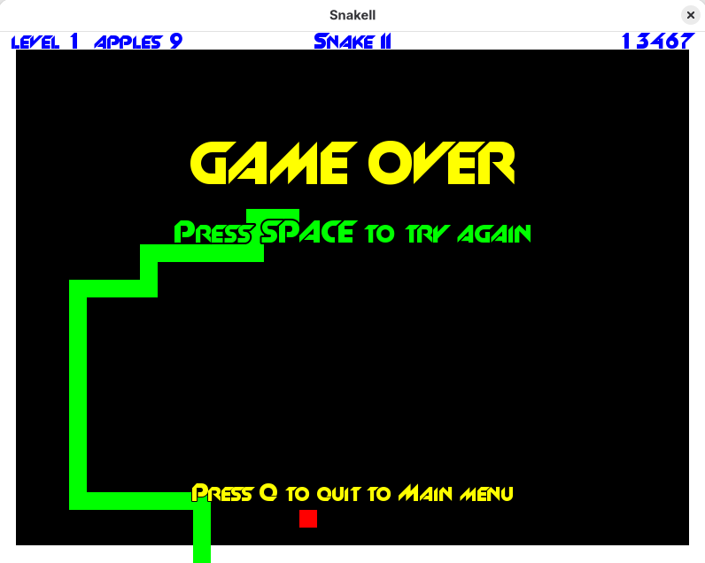
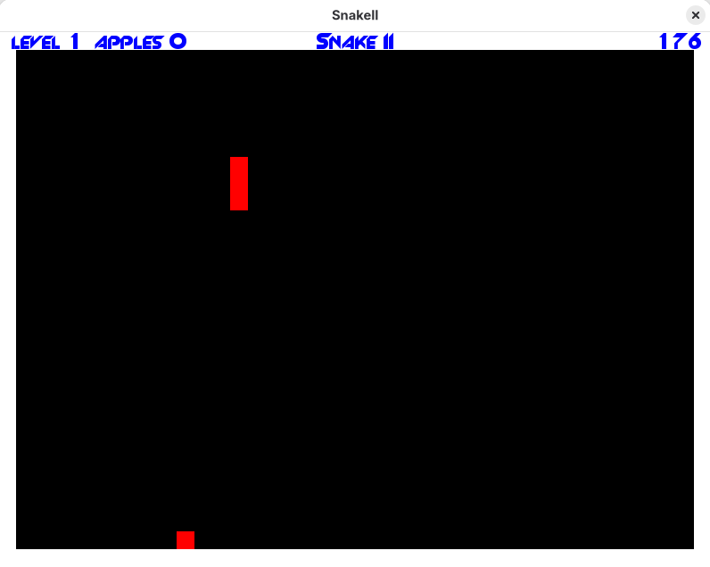
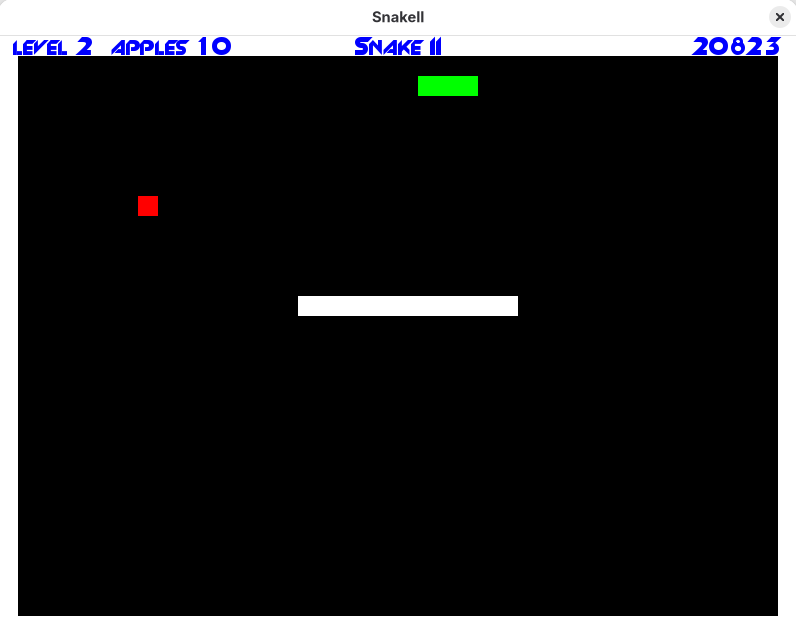

# Snake Game

Welcome to the Snake Game! This is a simple snake game implemented in C++ using the SFML library.

## How to Play

- Use the arrow keys to control the snake's direction: up, down, left, and right.
- Your objective is to eat 10 apples in order to advance to the next level.
- You can buy different colors for the snake using the apples you collect.
- There are also achievements to unlock as you progress in the game.

## To build the project 
Make sure SFML is installed to build the project.
### Fedora:
```
sudo dnf install SFML SFML-devel
```
### Ubuntu / Debian:
```
sudo apt update
sudo apt install libsfml-dev
```
### Arch / Manjaro:
```
sudo pacman -S sfml
```
### Build:
```
mkdir -p build
cd build
cmake ..
cmake --build .
```
### To run snake:
```
./snake
```
## Screenshots
<table>
  <tr>
    <td>
    <td>
    <td>
  </tr>
  <tr>
    <td>
    <td>
    <td>
  </tr>
</table>
